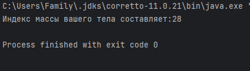

# Создание программы расчета индекса массы тела
_Цель_: закрепить знания примитивных типов данных и основ объектно-ориентированного программирования

## Входные данные:

Рост (м) и вес (кг) пользователя

## Выходные данные:

Вывод в консоль результата расчета индекса массы тела в формате целого числа

